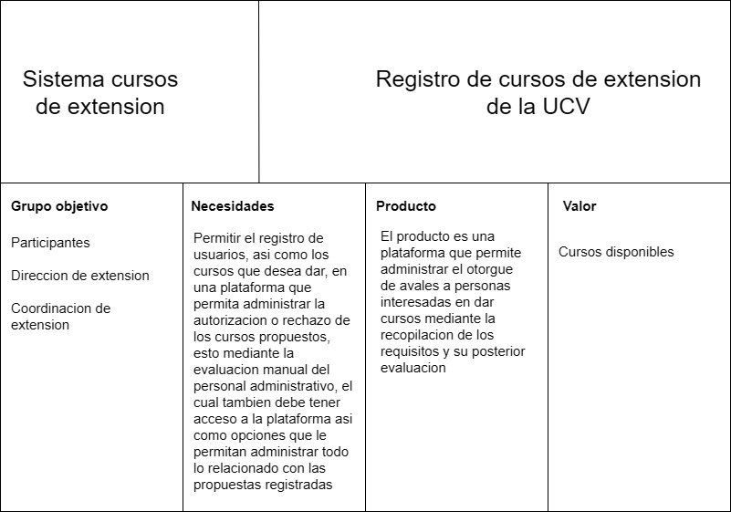
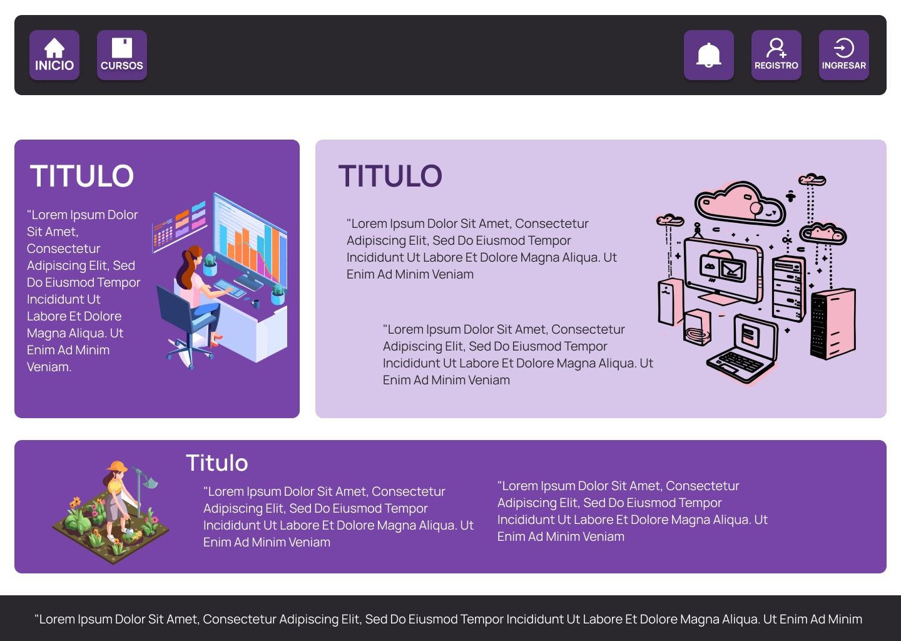
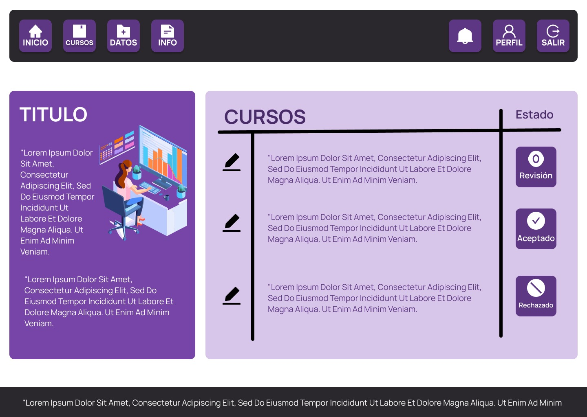
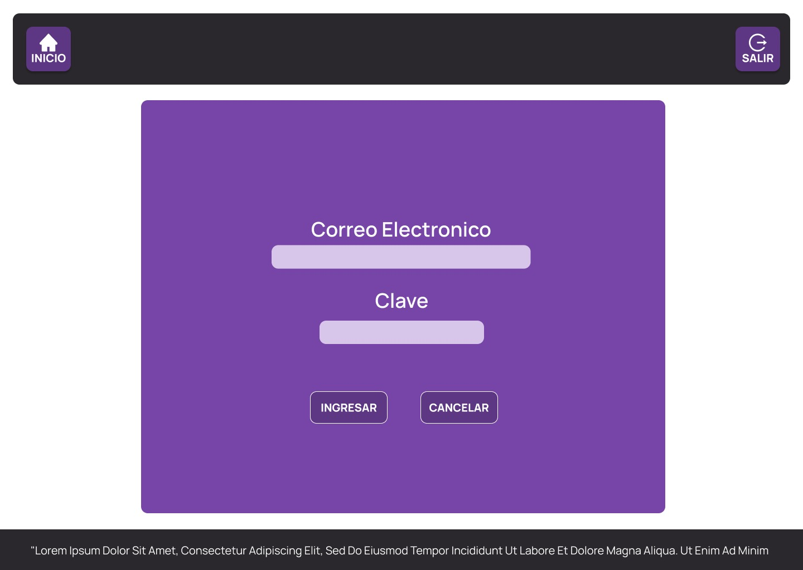
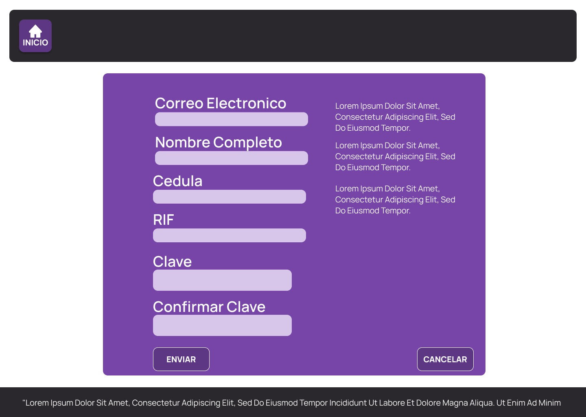
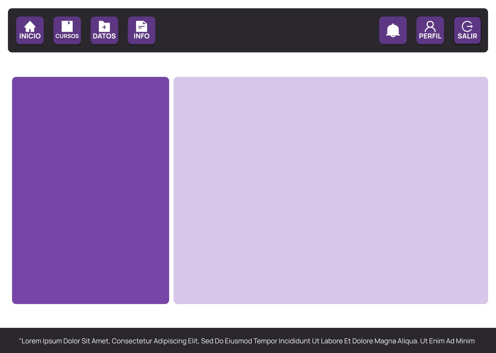

# Ingenieria_de_Software_Equipo8
## Integrantes

BRYAN ALBERTO SILVA ALCALA

DANIEL ALEJANDRO CALDERA VALERO

ADRIÁN ALEXANDER FERNÁNDEZ RUIZ 

ARTURO MILLÁN MAIZ	

LUIS FERNANDO MUÑOZ GONZALEZ

### Modelo_del_Dominio

### Modelo de Casos de Uso

